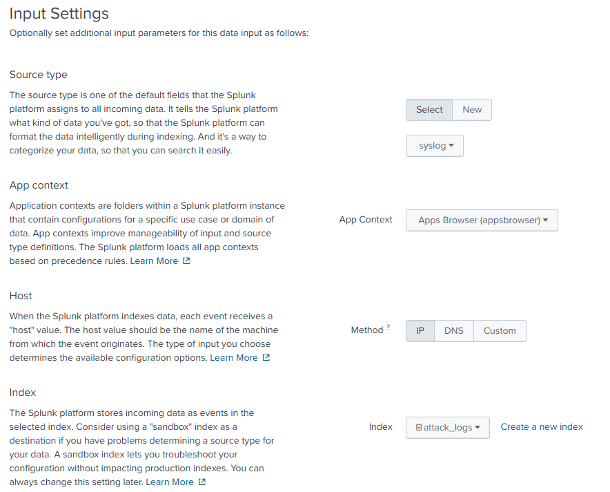
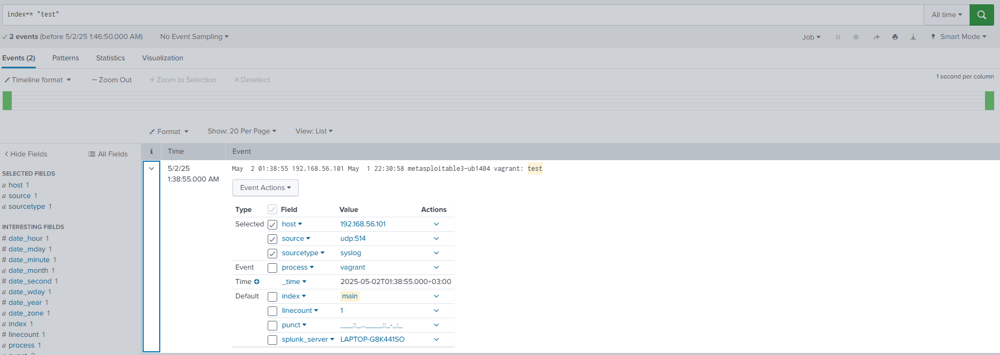
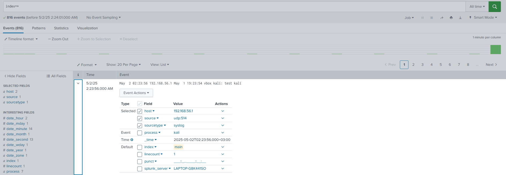

# Splunk Setup Summary: Kali Linux + Metasploitable3 Attack Lab (Windows Host)

This document summarizes the completed setup of Splunk for capturing and analyzing attack logs between:
- **Kali Linux (Attacker VM)**
- **Metasploitable3 (Victim VM)**

Splunk is installed and running on the **Windows host machine**.

---

## ✅ Setup Overview

- **Host OS**: Windows 10
- **Virtualization**: VirtualBox
- **Virtual Machines**:
  - Kali Linux (attacker)
  - Metasploitable3 (victim)
- **Splunk**: Installed on Windows host, accessed via `http://localhost:8000`

---

## 🔧 Configuration Details

### 1️⃣ Splunk Installation (Completed)

- Downloaded Splunk Enterprise Free from:  
  https://www.splunk.com/en_us/download.html

- Installed on Windows host.

- Started Splunk service and accessed the web interface at:  
  `http://localhost:8000`

- Created admin account and set up initial configurations.

---

### 2️⃣ Networking Configuration

- Configured **Host-Only Adapter** (or Bridged Network) for both Kali and Metasploitable3.

- Verified network connectivity:
  - Kali can ping host (`ping <host_ip>`)
  - Metasploitable3 can ping host

---

### 3️⃣ Splunk Data Input Setup

- In Splunk Web:
  - Went to **Settings → Data Inputs → UDP → New Local UDP**.
  - Configured port `514` (standard syslog).
  - Set sourcetype to `syslog`.
  - Created index named `attack_logs`.
  - Screenshot:
    

---

### 4️⃣ Metasploitable3 Log Forwarding

- Edited `/etc/rsyslog.conf` on Metasploitable3:
- by adding *.* @<host-ip>:514
- then saving it
- restart rsyslog
- Testing it by logging a test
- Screenshoot:

### 5 Kali Linux Log Forwarding

- We did the same steps in 4
- Screenshot:

