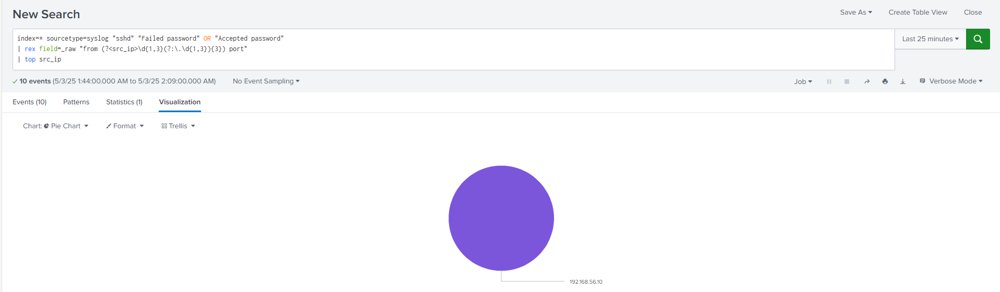

# Attack Visualization and Analysis (Completed)

This document explains the visualizations and analyses that we performed after executing the SSH brute-force attacks and collecting the logs in Splunk.

---

## Visualization 1: SSH Authentication Attempts

**Description:**
A time chart or bar chart displaying SSH login attempts over time.

**SPL Query:**

```spl
index=* sourcetype=syslog "sshd" | timechart count by action
```

**What it reveals:**

* Spikes in failed or successful login attempts.
* Time periods when brute-force activity was the highest.
* Helps identify which usernames and IP addresses were most frequently targeted.

---

## Visualization 2: Top Source IPs

**Description:**
A pie chart showing the top source IP addresses attempting SSH connections.

**SPL Query:**

```spl
index=* sourcetype=syslog "sshd" "Failed password" OR "Accepted password"
| rex field=_raw "from (?<src_ip>\d{1,3}(?:\.\d{1,3}){3}) port"
| top src_ip
```

**What it reveals:**

* Confirms that the Kali attacker machine was the primary source of SSH traffic to Metasploitable3.
* Highlights any other unexpected or noisy IPs if they appeared.

---

## Visualization 3: Failed vs Successful Logins

**Description:**
A stacked bar chart showing counts of failed and successful SSH logins.

**SPL Query:**

```spl
index=* sourcetype=syslog "sshd" "Failed password" OR "Accepted password"
| eval action = if(like(_raw, "%Failed password%"), "failed", "successful")
| stats count by action
```

**What it reveals:**

* Demonstrates how many attempts failed before success.
* Helps visualize the brute-force nature of the attack (many failures, few successes).

---

## Attack Comparison (Attacker vs Victim)

We compared data collected from both the attacker (Kali) and victim (Metasploitable3) environments.

**What we observed:**

* From the attacker side: logs of launched brute-force modules, successful login notifications, and script execution traces.
* From the victim side: syslog entries showing SSH authentication attempts, sudo command traces, and other system-level logs.

This comparison allowed us to map attacker actions to victim responses, confirming that the brute-force attack was successfully captured end-to-end.

---

## Deliverables

✅ Screenshot of SIEM integration (showing logs ingested from both Kali and Metasploitable3)

✅ Screenshot(s) of Splunk visualizations (time charts, bar charts, pie charts) used to analyze and understand the attack patterns

We will include these screenshots along with this explanation as part of our project deliverables.

