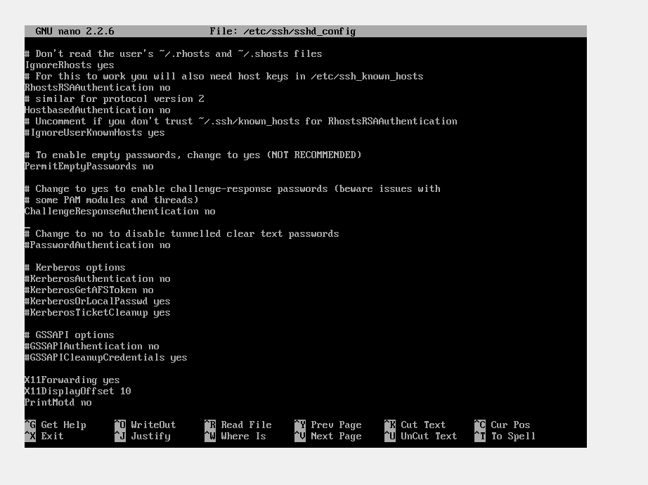

### **1. Analyze Original SSH Vulnerability**  

**Commands Executed**:  
```bash
systemctl status ssh          # Verify SSH is running  
ssh -V                       # Check vulnerable version  
sudo cat /etc/ssh/sshd_config # Review weak settings```





