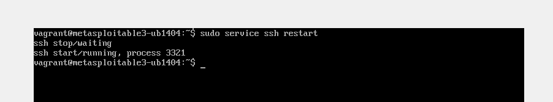

# *Defense Mechanisms Implemented*

We have deployed two complementary strategies to secure the SSH service on Metasploitable3:


1. SSH Configuration Hardening
2. Key-Based Authentication


### **1.1 Analyze Original SSH Vulnerability**  


**Commands Executed**:  
```bash
systemctl status ssh             # Verify SSH is running  
ssh -V                           # Check vulnerable version  
sudo cat /etc/ssh/sshd_config    # Review weak settings
```


### **1.2 Implement SSH Hardening**




Changes Made:

- Port	22 to 2222 : Avoid automated scans. 

- PermitRootLogin	yes	to no : Disable root access. 

- PasswordAuthentication	yes	to no :Force key-based auth. 

- MaxAuthTries:	(unset)	3	Limit brute-force attempts. 

- AllowUsers:	(unset)	msfadmin	Restrict valid users.

**Commands Executed**: 

```bash
sudo cp /etc/ssh/sshd_config /etc/ssh/sshd_config.bak  
sudo nano /etc/ssh/sshd_config  # Apply changes  
sudo service ssh restart
```


### **2.1 Set Up Key-Based Authentication**

Steps:

- Generate Key Pair (Kali Linux):
  


ssh-keygen -t rsa -b 4096 -f ~/.ssh/metasploitable3_key  

- Copy Public Key to Metasploitable3:
  
  


ssh-copy-id -i ~/.ssh/metasploitable3_key.pub -p 2222 msfadmin@192.168.56.101  

- Test Login:
  


ssh -i ~/.ssh/metasploitable3_key -p 2222 msfadmin@192.168.56.101  


### 3.1 Test Defenses

Attacks to Re-Run:

Metasploit Brute-Force:


Hydra Brute-Force:

